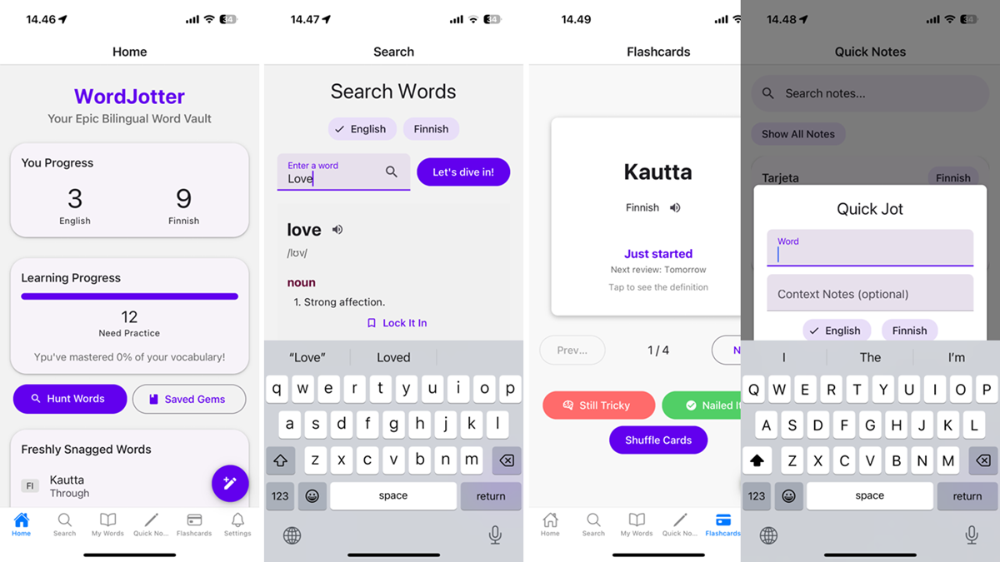

# WordJotter 📝

A bilingual vocabulary learning application that helps you capture, organize, and memorize English and Finnish words.



## Features ✨

### Dictionary Functionality

- **English Dictionary**: Search English words using the Free Dictionary API
- **Finnish Dictionary**: Look up Finnish words via RedFox Dictionary in external browser
- **Pronunciation**: Text-to-speech support for both languages
- **Comprehensive Details**: View definitions, examples, phonetics, and more

### Personal Vocabulary Management

- **Save Words**: Create your personal vocabulary collection with just a tap
- **Custom Notes**: Add personal notes and context to saved words
- **Categorization**: Organize words by categories for efficient learning
- **Quick Reference**: Access your entire word collection offline

### Learning Tools

- **Flashcards**: Practice vocabulary with interactive flashcard interface
- **Spaced Repetition**: Smart algorithm schedules reviews for optimal memorization
- **Daily Reminders**: Customizable study reminders to build consistent habits

### Unique "Quick Jot" Feature

- **Capture On-the-Go**: Quickly save new words during conversations without interruption
- **Process Later**: Look up and add details when you have time
- **Workflow Integration**: Seamless transition from quick capture to full vocabulary entry

## Tech Stack 🛠️

- **Framework**: React Native with Expo
- **UI Library**: React Native Paper for Material Design components
- **Navigation**: React Navigation for multi-screen experience
- **Local Storage**: SQLite for offline data persistence
- **APIs**:
  - Free Dictionary API for English definitions
  - RedFox Dictionary for Finnish words (external browser integration)
- **Expo APIs**:
  - expo-speech for pronunciation
  - expo-sqlite for local storage
  - expo-notifications for study reminders
  - expo-web-browser for Finnish dictionary integration

## Installation and Setup 🚀

### Prerequisites

- Node.js (LTS version recommended)
- npm or yarn
- Expo CLI
- iOS or Android device/emulator with Expo Go installed

### Installation Steps

1. Clone the repository:

   ```bash
   git clone https://github.com/emadbytes/wordjotter.git
   cd wordjotter
   ```

2. Install dependencies:

   ```bash
   npm install
   # or
   yarn install
   ```

3. Create an `.env` file in the project root with the following content:

   ```
   EXPO_PUBLIC_API_URL=https://api.dictionaryapi.dev/api/v2/entries
   EXPO_PUBLIC_FINNISH_DICTIONARY_URL=https://redfoxsanakirja.fi/fi/sanakirja/-/s/fin/eng
   EXPO_PUBLIC_ENABLE_SPEECH=true
   EXPO_PUBLIC_ENABLE_NOTIFICATIONS=true
   EXPO_PUBLIC_DEFAULT_LANGUAGE=en
   EXPO_PUBLIC_DATABASE_NAME=wordjotter.db
   ```

4. Start the development server:

   ```bash
   npx expo start
   ```

5. Scan the QR code with your Expo Go app (Android) or Camera app (iOS) to run WordJotter on your device.

## Usage Guide 📱

### Dictionary Search

1. Tap the "Search" tab in the bottom navigation
2. Select language (English or Finnish)
3. Enter a word and tap "Let's dive in!"
4. For English words: view definitions directly in the app
5. For Finnish words: the external RedFox Dictionary will open, then return to add your notes

### Saving Words

- For English words: tap "Lock It In" on any definition
- For Finnish words: enter the word, definition, and optional notes after looking it up

### Quick Jot

1. Tap the floating "+" button available throughout the app
2. Enter the word, select language, and add optional context
3. Tap "Snag it for Later"
4. Process your quick notes in the "Quick Notes" tab when you have time

### Learning with Flashcards

1. Go to the "Flashcards" tab
2. Tap a card to flip between word and definition
3. Mark as "Still Tricky" or "Nailed It!" to track your progress
4. Words you know well will appear less frequently

### Managing Your Words

- View all saved words in the "My Words" tab
- Filter by category or search by text
- Delete words by tapping the trash icon
- Hear pronunciation by tapping the speaker icon

## Project Structure 📂

The project follows a modular architecture:

- **src/screens**: Main application screens (Home, Search, MyWords, etc.)
- **src/components**: Reusable UI components (SpeakButton, QuickJotModal, etc.)
- **src/services**: Data and API services (database, dictionary, notifications)
- **src/navigation**: Navigation configuration
- **src/styles**: Global styles and theme
- **src/assets**: Static resources (images, icons)

## Future Roadmap 🔮

WordJotter is continually evolving with plans to add:

- **Enhanced Learning Features**: Multiple-choice quizzes and translation exercises
- **Advanced Analytics**: Detailed statistics and visual learning progress tracking
- **Cloud Integration**: Sync vocabulary across devices
- **Camera Integration**: Scan printed text to look up words
- **Enhanced Security**: Authentication for personal word lists
- **Research-Based Learning**: Improvements based on UX research and language acquisition studies

## Contributing 🤝

Contributions are welcome! Feel free to submit issues or pull requests.

## Credits & Acknowledgments 🙏

- [Free Dictionary API](https://dictionaryapi.dev/) for providing comprehensive English definitions
- [RedFox Dictionary](https://redfoxsanakirja.fi/) for Finnish language reference support
- [Expo](https://expo.dev/) team for their excellent mobile development toolchain
- [React Native Paper](https://callstack.github.io/react-native-paper/) for the Material Design component library
- Special thanks to [Juha Hinkula](https://github.com/juhahinkula), the instructor of the Mobile Programming course at Haaga-Helia UAS, for guidance and expertise
- The spaced repetition algorithm was inspired by memory research and established learning systems like Anki

## License 📄

This project is licensed under the MIT License - see the LICENSE file for details.

## About the Author 👨‍💻

WordJotter was created by Emad Yazdankhah as a final project for the Mobile Programming course at Haaga-Helia University of Applied Sciences. The application was inspired by personal experience learning English and Finnish as a non-native speaker.

---

_WordJotter - Transform your vocabulary learning journey, one word at a time._
